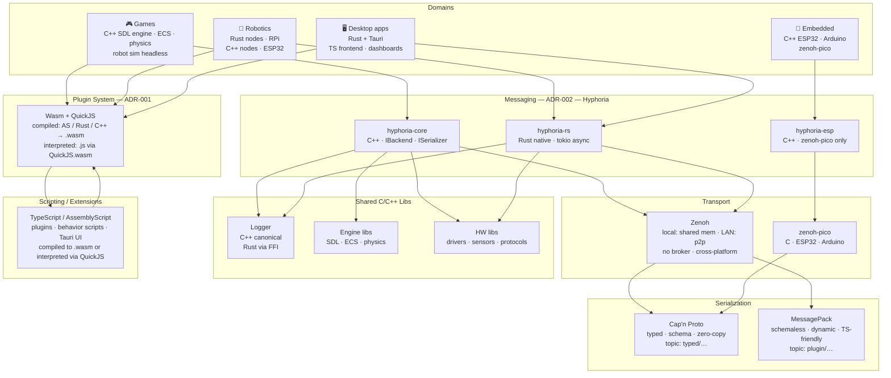
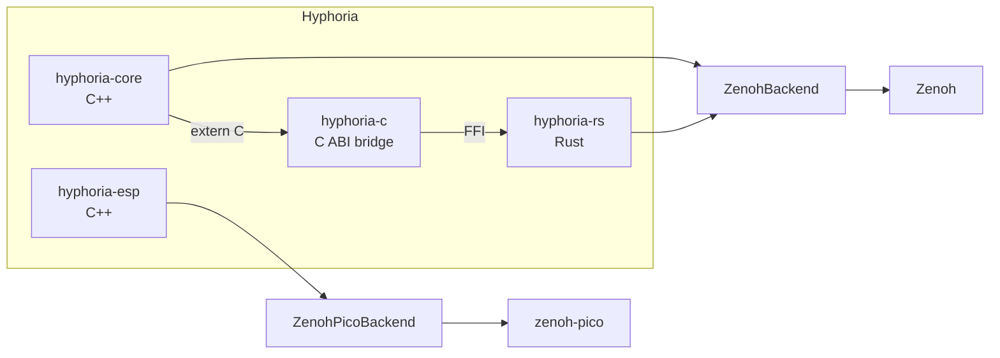
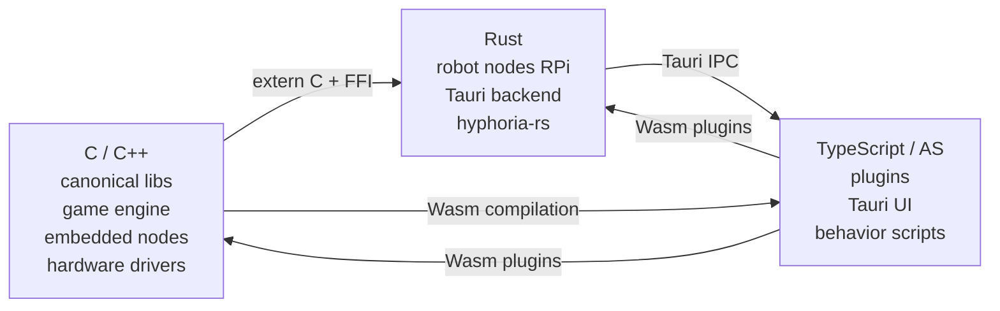

# ADR-000: Code Universe Architecture

**Status:** Accepted  
**Date:** 2026-07-01  
**Author:** Andrei

---

## Context

All personal and hobby projects span four domains: games, robotics, desktop apps, and embedded devices. They use three languages: C, C++, and Rust. Historically each project starts from scratch — new logger, new messaging, new scripting layer, new build setup. This means every project is isolated, improvements don't transfer, and context switching between projects means rebuilding mental and technical infrastructure each time.

The goal is a unified code universe where every project uses shared infrastructure and contributes back to it. The rule: **no project starts from scratch, no work benefits only one project.**

This ADR captures the full architecture of that universe. It is the master document. Other ADRs (plugin system, messaging) are subsystems of this one.

---

## Goals

- Whatever project is active (game, robot, app, firmware) — it uses shared libs, shared messaging, shared scripting
- Improvements to any shared layer immediately benefit all projects
- Languages interoperate cleanly: C++ libs usable from Rust, Rust services consumable from C++
- Switching between projects has low friction — infrastructure is always running, conventions are always the same
- Never reimplement logging, messaging, serialization, or scripting per project

---

## Full Architecture



---

## Domain Map

### Games — C++ SDL engine

The primary game runtime. Built in C++, uses SDL for windowing/input/audio. Has ECS and physics built in. Used for:

- Games (primary)
- Robot simulation — same engine, `ENGINE_HEADLESS` build flag strips SDL renderer, ECS + physics + Hyphoria remain active. Runs on RPi for behavior testing.
- Game tools and editors — SDL renders the tool UI

Does not use Bevy. The C++ SDL engine already has ECS and a renderer — Bevy adds nothing for this use case.

### Robotics — Rust + C++

- Raspberry Pi — Rust nodes. Full Linux, full HW access via `rppal` + `embedded-hal`. Hyphoria via `hyphoria-rs`.
- ESP32 / Arduino — C++ nodes. Arduino ecosystem for prototyping, ESP-IDF for production. Hyphoria via `hyphoria-esp` + `zenoh-pico`.
- Zakhar / LeOn projects live here.

### Desktop apps — Rust + Tauri

- Rust backend — business logic, Hyphoria subscriptions, file I/O
- TypeScript frontend — UI, dashboards, plugin system (Obsidian model)
- Types: robot control UIs, game companion tools, developer monitors, general productivity apps
- Subscribes to Zenoh topics to visualize robot and game state in real time

### Embedded — C/C++

- ESP32 and Arduino targets
- C++ only — Rust on ESP32 is still immature for hobby use
- `zenoh-pico` for transport — joins the same Zenoh bus as all other nodes
- No plugin system

---

## Shared Infrastructure

### Observability (see ADR-005)

microread aggregates logs from all nodes — Zenoh-connected nodes via `log/#` topics, embedded nodes via serial, and JavaScript/TypeScript plugins via WebSocket. Three consumption surfaces:

- `microread tail` — CLI, terminal streaming, CI-friendly
- VS Code extension — inline source decorations, live log panel
- Tauri log viewer — full GUI, first desktop app in the universe

microlog extension `ulog_hyphoria.h` registers Hyphoria as a microlog output target in one line. No heap allocation, non-blocking.

`@an-dr/microread-js` — npm package (zero dependencies) for logging from VS Code extensions, Obsidian plugins, and any TypeScript/JavaScript environment. Connects to the proxy WebSocket, buffers when disconnected, falls back to `console.log` silently.

### File exclusion (see ADR-004)

IGNORE is the single source of truth for file exclusion rules. One file per project, two usage paths:

- `generate` section → `ignore-cli` generates `.gitignore`, `.dockerignore`, etc. for external tools
- `native` section → your tools read directly via `libignore` — no generation, no drift

Generated files carry a `# Generated by IGNORE — do not edit` header and are never manually edited.

### Build system (see ADR-003)

Each domain owns its native build system. Corrosion bridges mixed projects:

| Domain | Build system |
|--------|-------------|
| C/C++ projects | CMake + abcmake |
| Rust projects | Cargo only |
| Mixed C++/Rust | CMake + abcmake + Corrosion |
| ESP32 / Arduino | CMake + ESP-IDF / Arduino CLI |
| TS/AS plugins | npm / asc — independent of CMake/Cargo |

Pure projects stay pure. Corrosion is opt-in, activated only when `rust/Cargo.toml` exists in the project.

### Plugin system (see ADR-001)

Two-tier Wasm system shared by games, robotics, and desktop apps:

- Compiled plugins: AssemblyScript / Rust / C++ → `.wasm`, loaded via wasmtime
- Interpreted plugins: `.js` files evaluated via QuickJS.wasm, no build step
- WIT file defines the API contract, `wit-bindgen` generates bindings for C++ and Rust
- Hot reload at frame/tick boundary

### Messaging — Hyphoria (see ADR-002)



Public API — four methods, identical in C++ and Rust:

```
publish(topic, payload)
subscribe(topic, callback)
request(topic, payload) -> Future<payload>
reply(ctx, payload)
```

Topic format: `domain/node_id/subject`

Transport selection:
```
same thread/task        →  in-process channels (tokio / std)
same process (C++)      →  InProcessBackend (lockless queue)
cross-process / LAN     →  ZenohBackend (shared mem for local, p2p for LAN)
ESP32 / Arduino         →  ZenohPicoBackend
```

### Serialization

Two lanes, signaled by topic prefix:

| Prefix | Serializer | Use case |
|--------|-----------|---------|
| `typed/` | Cap'n Proto | Typed inter-node messages — telemetry, events, commands |
| `plugin/` | MessagePack | Dynamic plugin messages — JS output, config, scripting |
| `raw/` | Raw bytes | Audio streams, binary blobs, passthrough |

### Shared C/C++ libs

All canonical implementations are C++. Rust consumes them via a C ABI wrapper layer.

**Logger** — canonical C++ implementation. Rust wrapper via `extern "C"`. Used by all nodes in all domains.

**Engine libs** — SDL, ECS, physics (Box2D). Used by game engine and robot simulation.

**HW libs** — sensor drivers, protocol implementations (NFC, BLE, CAN, I2C, SPI). Shared between embedded C++ nodes and RPi C++ code via the same headers.

C ABI wrapper convention for all libs:

```cpp
// canonical: MyLib.hpp (C++)
// wrapper:   mylib_c.h (C ABI)

typedef void* mylib_handle_t;
mylib_handle_t mylib_create(...);
void           mylib_destroy(mylib_handle_t);
int            mylib_do_thing(mylib_handle_t, ...);  // returns error code
```

```rust
// Rust safe wrapper over C ABI
pub struct MyLib(mylib_handle_t);
impl MyLib {
    pub fn new(...) -> Result<Self, Error> { ... }
    pub fn do_thing(&self, ...) -> Result<(), Error> { ... }
}
impl Drop for MyLib {
    fn drop(&mut self) { unsafe { mylib_destroy(self.0) } }
}
```

### Scripting — TypeScript / AssemblyScript

- TypeScript: Tauri frontend, robot behavior scripts (Deno/Bun), dashboard plugins
- AssemblyScript: compiled to `.wasm` for Wasm plugin tier — TypeScript-like syntax, near-native performance
- Plugin API defined in WIT, consumed identically from all domains
- Interpreted path: plain `.js` files, evaluated via QuickJS.wasm, no build step required

---

## The "No Scratch" Rule

Every project must contribute to at least one shared layer:

| Project type | Contributes to |
|---|---|
| Game | Engine libs, plugin API extensions |
| Robot | HW libs, Hyphoria topic schemas |
| Desktop app | Plugin API, Tauri UI components |
| Embedded | HW drivers, zenoh-pico extensions |

If a component doesn't fit in a shared layer — it's a prototype. Prototypes are fine, but they don't count as universe work until they graduate to a shared layer.

---

## Language Roles



- C/C++ owns: performance-critical code, canonical lib implementations, embedded targets, game engine
- Rust owns: networked services, async logic, Tauri backend, RPi robot nodes
- TypeScript owns: UI, scripting, plugin authoring, behavior logic

---

## Alternatives Considered

**Per-project infrastructure (status quo)**  
Each project gets its own logger, messaging, and scripting. Simple, no coordination overhead. Rejected because it means every project restarts from zero, improvements don't transfer, and the same bugs get fixed multiple times.

**Single language (all Rust or all C++)**  
Eliminates the FFI layer entirely. Rejected because C/C++ is non-negotiable for embedded targets (ESP32, Arduino) and the existing game engine investment; Rust is non-negotiable for async networked services and Tauri. The FFI boundary is a real cost but smaller than rewriting either side.

**ROS 2 as the unifying framework**  
Solves messaging and discovery. Rejected because it is Linux-centric, owns the main loop, doesn't cover games or desktop apps, and its build system (colcon/ament) is incompatible with the CMake + Cargo build approach. Hyphoria + Zenoh covers the same transport/discovery needs without the constraints.

**Bevy as the game and simulation engine**  
Rust-native ECS + renderer. Rejected because the C++ SDL engine already has ECS and a renderer — Bevy adds nothing. Adding Bevy would mean a second game framework with a conflicting plugin system.

---

## Consequences

**Positive:**
- Any new project has logging, messaging, serialization, and scripting on day one
- Improvements to shared libs propagate to all domains immediately
- Cross-domain scenarios work naturally: robot publishes telemetry, game subscribes to same topic for simulation, dashboard subscribes for monitoring
- Plugin system works identically in game engine and Tauri app — same `.wasm` files
- Language interop has a clear, repeatable pattern (C ABI wrapper convention)

**Negative:**
- Two Hyphoria implementations (C++ + Rust) must stay in sync manually
- C ABI wrapper layer is boilerplate that must be written for every shared C++ lib
- Zenoh must be validated on each new target — it works everywhere in theory, needs confirmation in practice
- Topic keyspace must be designed upfront — retrofitting is expensive once nodes depend on it

**Constraints:**
- RT-critical code (robot control loops, game physics) stays inside nodes. It does not use Hyphoria.
- Every cross-language boundary goes through a C ABI layer. No direct C++ ↔ Rust without `extern "C"`.
- Topic keyspace is `domain/node_id/subject`. No freeform topics.
- Every new shared lib gets a C ABI wrapper on day one, not retrofitted later.
- All topic strings are defined in `hyphoria-core/include/hyphoria/topics.h`. Raw string literals for topics are forbidden in application code.

---

## Open Questions

- Monorepo vs multi-repo — shared libs need versioning across projects. Current abcmake/SPA approach suggests multi-repo with explicit versioning. Decide before shared libs proliferate.
- Canonical topic schema — resolved. See ADR-002: `topics.h` in `hyphoria-core`, mirrored to `topics.rs` with a format validation test, `topics.ts` generated by a simple script. All domains depend on `hyphoria-core` already.

---

## Related ADRs

- ADR-001: Plugin System Architecture — Wasm + QuickJS two-tier plugin system
- ADR-002: Messaging System (Hyphoria) — transport, backends, serialization detail
- ADR-003: Build System — abcmake + Cargo + Corrosion, per-domain ownership
- ADR-004: File Exclusion System (IGNORE) — structured ignore format, libignore, ignore-cli
- ADR-005: Log Reader and Serial Client (microread) — log aggregator, proxy, CLI, VS Code extension, Tauri app
